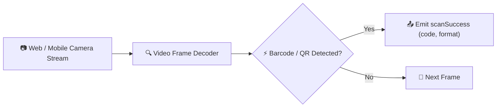

# 📷 @marxa-digital/scanner (Angular Barcode & QR Code Reader)

[](https://angular.io)
[](https://www.typescriptlang.org)
[](LICENSE)

An Angular component library integrating multi-format **Barcode (EAN-13, EAN-8, Code 128, Code 39) and QR Code scanning** via web and mobile cameras with configurable overlay targets, torch support, and reactive event outputs.

---

## 💡 Overview

Designed for inventory auditing, point-of-sale verification, and package tracking, `mx-scanner` abstracts camera media stream permissions and decoding frames using `@zxing/ngx-scanner` and `angular2-qrscanner`.



---

## ✨ Features

- 🎯 **Multi-Format Support:** QR Code, EAN-13, EAN-8, Code 128, Code 39, Data Matrix.
- 📱 **Camera Switching & Torch Control:** Toggle front/rear camera and flashlight on supported devices.
- 🎨 **Visual Scan Overlay:** Integrated targeting frame with customizable boundary styles.
- ⚡ **Reactive Event Emitters:** `(scanSuccess)` and `(scanError)` bindings.

---

## 🚀 Installation

Install the package and its peer dependencies:

```bash
npm install @marxa-digital/scanner @zxing/ngx-scanner
```

---

## 💻 Usage Example

### 1. Import `MxScannerModule`
```typescript
import { NgModule } from '@angular/core';
import { MxScannerModule } from '@marxa-digital/scanner';

@NgModule({
  imports: [
    MxScannerModule
  ]
})
export class InventoryModule {}
```

### 2. Template
```html
<mx-scanner
  [enable]="isScanning"
  [torch]="torchActive"
  (scanSuccess)="onCodeScanned($event)"
  (scanError)="onScanError($event)"
></mx-scanner>
```

### 3. Component Logic
```typescript
import { Component } from '@angular/core';

@Component({
  selector: 'app-inventory-scan',
  templateUrl: './inventory-scan.component.html',
  styleUrls: ['./inventory-scan.component.scss']
})
export class InventoryScanComponent {
  isScanning = true;
  torchActive = false;

  onCodeScanned(result: string) {
    console.log('📦 Code scanned successfully:', result);
    // Process inventory lookup...
  }

  onScanError(error: any) {
    console.warn('Scan error or permission denied:', error);
  }
}
```

---

## 📄 License

Distributed under the [MIT License](LICENSE). Created by [Jorge Guzmán (@jgu7man)](https://github.com/jgu7man).
